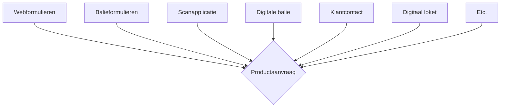
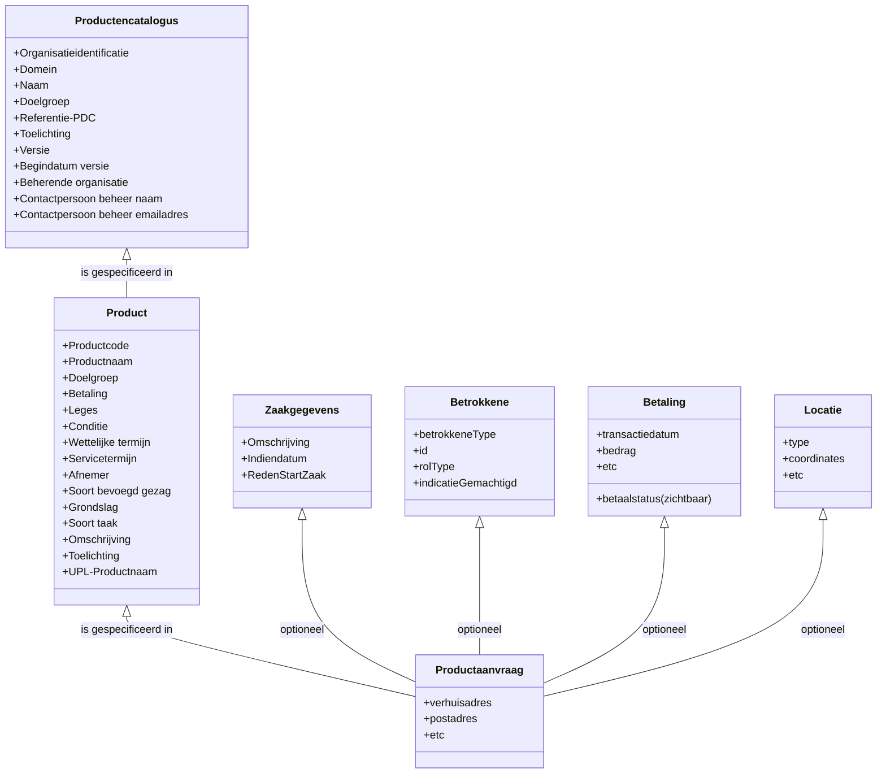
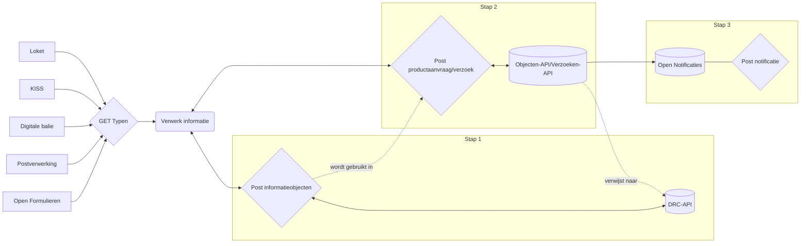
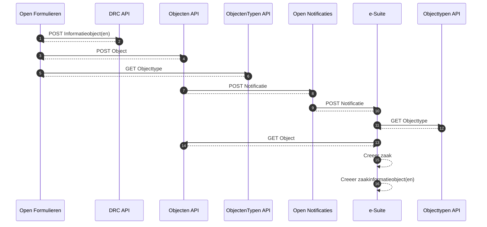

# Inleiding

De gemeente Rotterdam vervangt de formuliere-oplossing voor online formulieren van de e-Suite voor een oplossing met onder andere Open Formulieren. 

Belangrijke requirements bij de aansluiting van deze componenten zijn;

- Er wordt gebruik gemaakt van de ZGW-API’s
- Formuliergegevens kunnen inhoudelijk hergebruikt worden (liefst uiteindelijk zonder PDF)
- Er is geen verplichte koppeling vooraf tussen formulier en het uiteindelijke zaaktype

Alleen koppelen via het design pattern ‘productaanvraag’ voldoet aan deze requirements.

<aside>
💡 De term ‘productaanvraag’ wordt in deze gelijkgesteld met de term ‘verzoek’.

</aside>

## Relatie tot ontwikkelingen

De productaanvraag, of in ieder geval gedeeltes daarvan, kunnen uiteindelijk worden ondergebracht in een specifieke API. Hiervoor zijn initiatieven richting de verzoeken API ontplooid. Meer lees je op de [de website van de VNG](https://verzoeken-api.vng.cloud/api/v1/schema/).

Er gaan ook stemmen op om bijvoorbeeld de betaalfunctionaliteit uit Open Formulieren te verwijderen. De functionaliteit kan als losstaand component in een breder toepassingsgebied ingezet worden. Denk bijvoorbeeld aan betalingen tijdens de behandeling van een proces, of betalen in termijnen.

Vooralsnog gaan we in Rotterdam roeien met de riemen die we hebben. Dat betekent dat we koppelen met de ‘productaanvraag’ met een enkel schema en dat betalingen daarvan onderdeel zijn.

## Wat is de productaanvraag?

- De productaanvraag is een JSON-document met de gegevens die nodig zijn voor de levering van het product of dienst
- De productaanvraag is een persistent object en wordt gerelateerd aan de zaak
- Het betreft een gecentraliseerd punt in het landschap: alle aanvraagcomponenten in het landschap vullen de productaanvraag
- De productaanvraag (JSON-document) wordt voorzien van een productaanvraagType
- Het productaanvraagType (JSON-schema) kan duiding en validatie bieden over de velden in het JSON-document



## Waarom de productaanvraag?

Het gebruik van de productaanvraag heeft een aantal voordelen:

- Ontkoppelbaarheid: door het werken met productaanvragen hoeft de formulierenapp alleen maar te weten welke gegevens voor welk product moeten worden uitgevraagd, en niet welke zaak van welk zaaktype naar aanleiding van die aanvraag eventueel moet worden gestart.
    - Nb. De relatie tussen de productaanvraag en mogelijke zaaktypen zal in de toekomst in de PTC worden vastgelegd.
- Compleetheid: we standaardiseren een extra deel van het proces dat leidt tot levering van producten en diensten, namelijk (het generieke deel van) de gegevens die nodig zijn voor het aanvragen hiervan.
- Flexibeler: bij het indienen van een verzoek hoeft nog niet duidelijk te zijn hoe dat verzoek zal worden behandeld.
- ‘Separation of concerns’: er ontstaat een duidelijk onderscheid tussen ‘klantorders’ en interne ‘productie-/pickorders’.
- Verantwoording: de informatie die bij de intake aanwezig was, is de informatie die hoort bij het verzoek. Daarmee is meteen duidelijk dat informatie die aan een zaak (of een andere behandelwijze) is gekoppeld, na de initiële aanvraag is toegevoegd.
- Archivering: door het aanbrengen van de relatie tussen de productaanvraag en de zaak loopt deze mee in de archiveringskadans. De app die de productaanvraag creëert kan worden gewist.
    - Nb. De archiefbeheercomponent moet aangepast worden om het verwijderen van productaanvragen mogelijk te maken.

## Hoeveel productaanvragen gaan er ontstaan?

Omdat de productaanvraag een oplossing biedt voor de input- en output-zijde van een aanvraag zijn beide kanten variabel. Een aanvraag kan verschillende data nodig hebben om te verwerken.

- Aan de input-zijde: denk aan het verschil tussen de data benodigd voor een vergunning versus een verhuizing.
- Aan de output-zijde: denk aan applicaties die volledig conform de ZGW-API’s werken, en applicaties die dat gedeeltelijk niet kunnen, en andere input nodig hebben om werkprocessen te starten. De verwachting is dat de output-zijde na verloop van tijd generiek wordt.

### Voorbeeld productaanvraag

Een productaanvraag wordt opslagen als JSON document.

JSON (JavaScript Object Notation) is een op text gebaseerd gegevensformaat dat wordt gebruikt voor het uitwisselen van gegevens tussen computers. Het is een populair formaat omdat het gemakkelijk te lezen is voor mensen en gemakkelijk te verwerken door computers.

In JSON worden gegevens opgeslagen als een verzameling van paren "sleutel-waarde" (key:value-pairs). De sleutel is een naam die aan een specifieke waarde is gekoppeld, terwijl de waarde kan zijn wat dan ook, zoals een nummer, een tekst, een boolean (waar of onwaar) of zelfs een andere verzameling gegevens.

Hier is een voorbeeld van hoe JSON-gegevens eruit kunnen zien:

```json
{
"project": "RAVE",
"gemeente": "Rotterdam",
"status": "In onderzoek"
}
```

Dit is een concept-JSON voor een productaanvraag Verhuizing die opgepakt wordt door de Atos e-Suite:

```json
{
    "url": "https://objecten-api.example.com/api/v1/objects/095be6",
    "uuid": "095be6",
    "type": "https://objecttypenen-api.example.com/api/v1/objects/2fbf6c",
    "record": {
        "index": 0,
        "typeVersion": 1,
        "data": {
            "zaakgegevens": {
								"identificatie": "123123",
								"taal" : "Nederlands",
                "aanvraagtype": "verhuizing",
                "communicatiekanaal": "Internet",
                "omschrijving": "Verhuizing Blaak 27",
                "toelichting": "Nieuw huis gekocht"
            },
            "betrokkenen": [
                {
                    "betrokkeneType": "natuurlijk_persoon",
                    "inpBSN": "111222333",
                    "roltypeOmschrijving": "initiator",
                    "indicatieMachtiging": "gemachtigde",
										"indicatieCorrespondentie": false
                }, {
                    "betrokkeneType": "natuurlijk_persoon", 
                    "inpBSN": "123456788",
                    "roltypeOmschrijving": "mede-initiator",
                    "indicatieMachtiging": "machtiginggever",
										"indicatieCorrespondentie": true
                }, {
                    "betrokkeneType": "medewerker", 
                    "id": "MDW123",
                    "roltypeOmschrijving": "klantcontacter",
                    "indicatieMachtiging": null,
										"indicatieCorrespondentie": false
            ],
            "betaling": {
                "statusCode": "5",
                "transactieId": "123456784",
                "zaakKenmerk": "2022ESUITE0320",
                "bedrag": "19.20",
                "melding": null,
                "transactiedatum": "20220202",
                "status": "geslaagd"
            },
            "bron": "Open Formulieren",
            ,
            "bijlagen": [
                "https://documenten-api.example.com.nl/etc",
                "https://documenten-api.example.com.nl/etc"
            ]
        },
        "zaakgeometrie": {
            "type": "Point",
            "coordinates": [52.36673378967122, 4.893164274470299]
        },
					"aanvraagGegevens": {
                "uw-gegevens": {
                    "voornaam": "Jan",
                    "achternaam": "Vries",
                    "tussenvoegsel": "de",
                    "geboortedatum": "1980-12-31"
                },
                "uw-verhuizing": {
                    "beschrijving": "Lorem ipsum..."
                }
            },
        "startAt": "2023-01-01T12:00:00",
        "endAt": null,
        "registrationAt": "2023-01-01T12:00:00",
        "correctionFor": null,
        "correctedBy": null
	    }
    }
```

Het schema inclusief opmerkingen
    
    ```json
    {
      "url": https://objecten-api.example.com/api/v1/objects/095be6,
      "uuid": "095be6",
      "type": https://objecttypenen-api.example.com/api/v1/objects/2fbf6c,
      "record": {
        "index": 0,
        "typeVersion": 1,
        "data": {
          "zaakgegevens": {
            "identificatie": "123123",
            //De unieke identificatie van de ZAAK binnen de organisatie die verantwoordelijk is voor de behandeling van de ZAAK. Wordt in de e-Suite NIET gebruikt als zaaknummer.
            "taal": "Nederlands",
            //Enum:[ English, Nederlands ]
            "aanvraagtype": "verhuizing",
            //Uniek kenmerk van het type aanvraag
            "communicatiekanaal": "Internet",
            //string($uri) maxLength: 1000
            "omschrijving": "Verhuizing Blaak 27",
            //Een korte omschrijving van de zaak. maxLength: 80
            "toelichting": "Nieuw huis gekocht"
            //Een toelichting op de zaak. maxLength: 1000
          },
          "betrokkenen": [
            {
              "betrokkeneType": "natuurlijk_persoon",
              //Enum:[ natuurlijk_persoon, niet_natuurlijk_persoon, vestiging, organisatorische_eenheid, medewerker ]
              "inpBSN": "111222333",
              //Keuze uit: inpBSN, inp
              "roltypeOmschrijving": "initiator",
              //Enum:[ adviseur, behandelaar, belanghebbende, beslisser, initiator, klantcontacter, zaakcoordinator, mede_initiator ]
              "indicatieMachtiging": "gemachtigde",
              //Enum:[ gemachtigde, machtiginggever, null ]
              "indicatieCorrespondentie": false
              //boolean
            },
            {
              "betrokkeneType": "natuurlijk_persoon",
              "id": "123456788",
              "roltypeOmschrijving": "mede-initiator",
              "indicatieMachtiging": "machtiginggever",
              "indicatieCorrespondentie": true
            },
            {
              "betrokkeneType": "medewerker",
              "id": "MDW123",
              "roltypeOmschrijving": "klantcontacter",
              "indicatieMachtiging": null,
              "indicatieCorrespondentie": false
            }
          ],
          "betaling": {
            "statusCode": "5",
            //Enum: [ conform betaalstatussen Ogone/Ingenico ]
            "transactieId": "123456784",
            "kenmerk": "2022ESUITE0320",
            // Idem aan identificatie. Wens e-Suite: met e-Suite zaaknummer registreren in database (zoals IST)
            "bedrag": "19.20",
            "melding": null,
            "transactiedatum": "20220202",
            "status": "geslaagd"
            //Enum: [ conform betaalstatussen Ogone/Ingenico ] 
          },
          "bron": "Open Formulieren",
          "bijlagen": [
            https://documenten-api.example.com.nl/etc,
            https://documenten-api.example.com.nl/etc
          ],
          "aanvraagGegevens": {
            //Catch-all volgt vanaf hier
            "uw-gegevens": {
              "voornaam": "Voorbeeld",
              "achternaam": "Vries",
              "tussenvoegsel": "de",
              "geboortedatum": "1980-12-31"
            },
            "uw-verhuizing": {
              "beschrijving": "Lorem ipsum..."
            }
          }
        },
        "geometry": {
          //oneOf GeoJSON point geometry, GeoJSON multi-point geometry, et cetera (zie schema ZAAK voor duiding)
          "type": "Point",
          "coordinates": [
            52.36673378967122,
            4.893164274470299
          ]
        },
        "startAt": "2023-01-01T12:00:00",
        "endAt": null,
        "registrationAt": "2023-01-01T12:00:00",
        "correctionFor": null,
        "correctedBy": null
      }
    }
    ```
    

### Betrokkenen

Over de manier waarop betrokkenen worden opgeslagen lees meer op de pagina [Betrokkenen in de productaanvraag](Productaanvraag%20c2c088237085495fb4c85023e641987e/Betrokkenen%20in%20de%20productaanvraag%2001cb428bde4e430cb5b03b43876bb023.md). 

## Validatie

### Hoe valideer je de informatie in de productaanvraag?

Om de gegevens in de aanvraag voor een product of dienst te ordenen en te bevestigen wordt een schema gebruikt. In de architectuur kan zo’n schema worden vervangen door het woord “type”. Voorbeeld: Een zaaktype is een indeling van de gegevens die horen bij een zaak van een specifiek type.

 Een JSON Schema is een specificatie voor het valideren van de structuur en de inhoud van JSON-documenten. Het kan worden gebruikt om te controleren of een JSON-bestand voldoet aan bepaalde regels en om te bepalen of het gegevens bevat die verwacht werden. JSON Schema kan ook worden gebruikt om de leesbaarheid en het begrip van een JSON-document te verbeteren door het toevoegen van opmerkingen en documentatie.

### Een of meerdere schema’s?

Een productaanvraagtype is samenraapsel van een of meerdere schema's. 

Dat heeft een aantal voordelen:

- Het is makkelijker om te onthouden en te begrijpen: Door het schema op te splitsen in kleinere schemas, is het makkelijker om te onthouden wat er in elk schema staat en hoe het gebruikt wordt.
- Het maakt het makkelijker om aan te passen: Als je meerdere schemas hebt, kun je gemakkelijk wijzigingen aanbrengen in één van de schemas zonder dat je de hele structuur hoeft te wijzigen.
- Het kan helpen om fouten te voorkomen: Als je meerdere schemas hebt, kun je specifieke regels opstellen voor elk schema om ervoor te zorgen dat de gegevens correct zijn. Dit kan helpen om fouten te voorkomen voordat ze de toepassing bereiken.
- Het kan helpen om tijd te besparen: Als je meerdere schemas hebt, kun je deze hergebruiken voor verschillende doeleinden.
- Het kan helpen om gegevens beter te organiseren: Dit kan helpen om alles gemakkelijker te vinden en te begrijpen.

<aside>
💡 Voor de mapping tussen Open Formulieren en specifiek de e-Suite gebruiken we vooralsnog een enkel schema. Dat doen we omdat de kans op rework anders erg groot is; er zijn nog geen landelijke afspraken over bepaalde schema's. Waarschijnlijk komen veel statische schema's terug in de Verzoeken-API.

</aside>

### Waar zou een uniek schema uit kunnen bestaan?

Een uniek schema bestaat met name uit een verzameling waarden die op verschillende locaties worden gebruikt. Door naar een enkele definitie van deze waardeset te verwijzen, hoef je bij een wijziging niet de productaanvraagtypen aan te passen, maar alleen het type waarnaar verwezen wordt.

Hier is een voorbeeld van hoe meerdere schema’s gebruikt kunnen worden om een productaanvraag te maken:

- Een schema voor de betrokkene
- Een schema voor de betaling
- Een schema voor de benodigde procesgegevens
- Et cetera

### Uitgangspunten van een schema

- Het schema is zowel richtinggevend als validerend.
- De benodigde data van een productaanvraag voor een specifiek product kan gedefinieerd worden met een of meerdere schema’s.
- Dit schema kan worden opgehaald door alle componenten in het landschap.
- Deze componenten weten dan welke informatie gevuld moet worden.

Zo centraliseren we het beheer van de data die nodig is voor de levering van het product of dienst.

### Samenhang tussen schema’s



## Design pattern

### Omni-channel flow chart



### Sequence diagram

